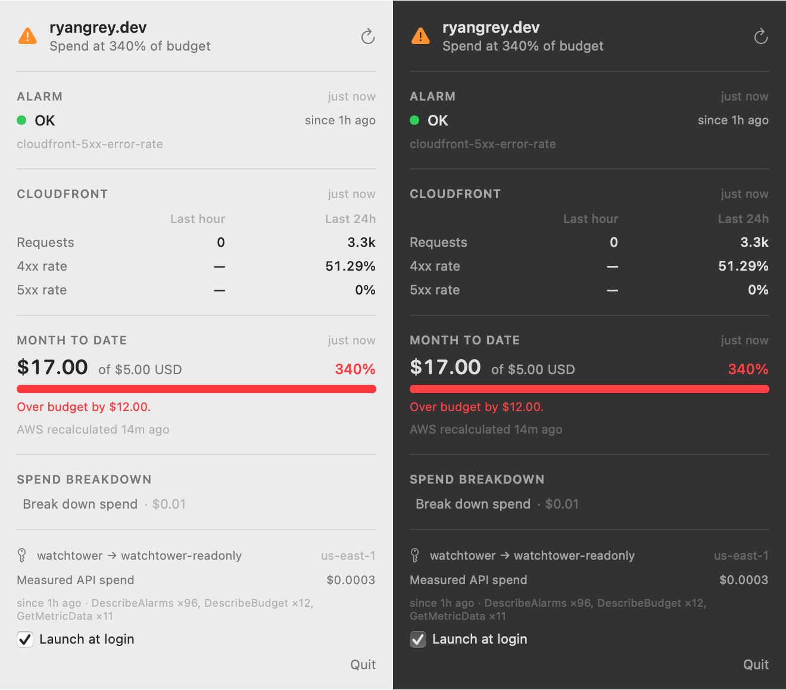
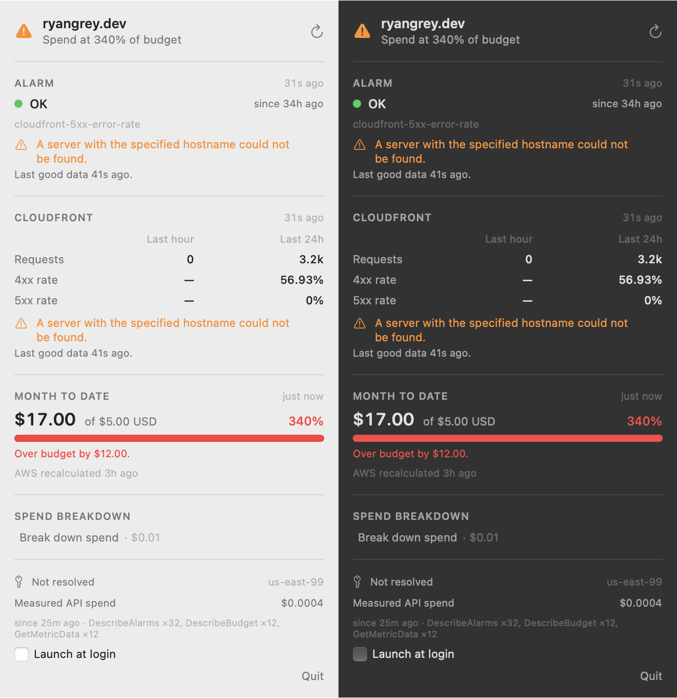
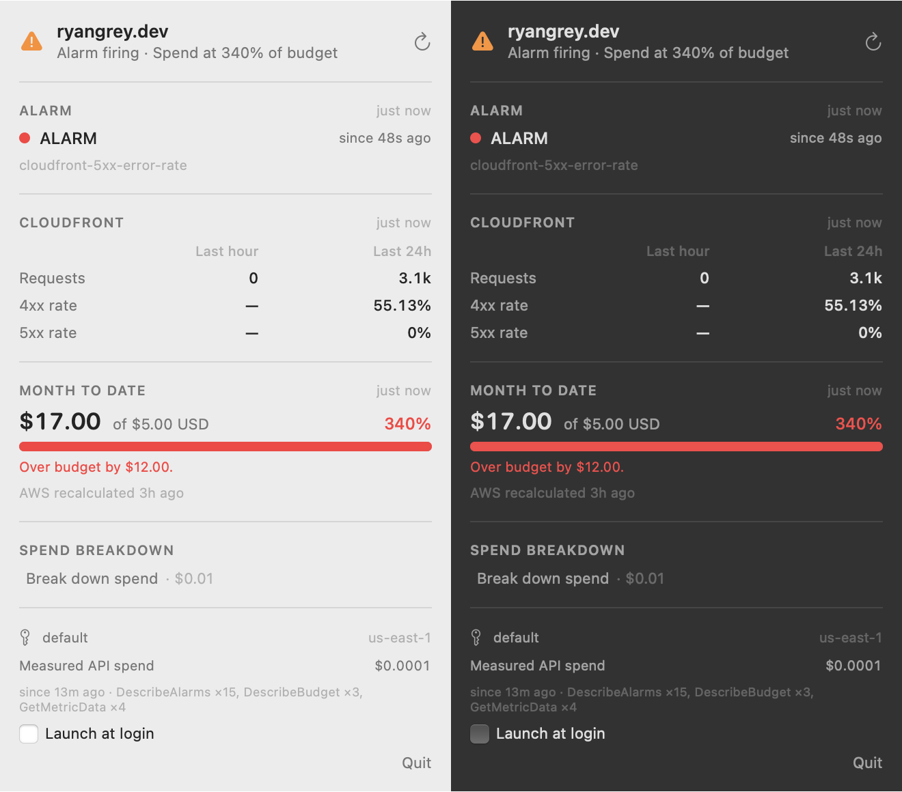

# Cloud Watchtower

A macOS menu-bar monitor for [ryangrey.dev](https://ryangrey.dev): CloudFront traffic and
error rates, CloudWatch alarm state, and month-to-date AWS spend against a $5 budget.

Swift + SwiftUI, `MenuBarExtra`, no Dock icon. **No dependencies at all** — not even the AWS
SDK. Runs locally against `~/.aws`.



The menu-bar glyph encodes state: `cloud` when everything is fine, a warning triangle when
the alarm is firing or spend is over 80% of budget, `cloud.slash` when the app cannot tell.

---

## Quick start

```sh
scripts/make-app.sh                 # builds and assembles dist/Watchtower.app
```

Point it at your account. These are **not** committed — the repo ships placeholders, because
an account ID plus an IAM user name is enough for a stranger to construct valid ARNs for your
account:

```sh
defaults write dev.ryangrey.watchtower accountId      -string "123456789012"
defaults write dev.ryangrey.watchtower distributionId -string "EXXXXXXXXXXXXX"
defaults write dev.ryangrey.watchtower alarmName      -string "cloudfront-5xx-error-rate"
defaults write dev.ryangrey.watchtower budgetName     -string "my-monthly-budget"
defaults write dev.ryangrey.watchtower profileName    -string "watchtower"
defaults write dev.ryangrey.watchtower region         -string "us-east-1"

open dist/Watchtower.app
```

Until `accountId` and `distributionId` are set, the app says so rather than failing with a
confusing AWS error.

Verify the AWS path from a terminal without touching the UI:

```sh
dist/Watchtower.app/Contents/MacOS/Watchtower --selftest --profile default
```

`--render` writes at 2x by default (`--scale 1` for 1x); `scripts/optimise-png.py` converts the
result to an indexed PNG, which is how the screenshot on ryangrey.dev got from 193 KB to 77 KB.

Other entry points: `--preview` (panel in a normal window, light and dark side by side) and
`--render <path.png>` (draw the panel straight to a PNG, no screen involved).

---

## Cost is a design constraint

This app watches a $5/month budget. It would be absurd for it to cost a meaningful fraction
of that. Every polling decision below falls out of one number: **Cost Explorer bills about
$0.01 per request**, and nothing else Watchtower calls costs anything material.

### What it actually costs

| Call | Interval | Calls/mo | Billing | $/mo |
|---|---|---|---|---|
| `DescribeAlarms` | 60 s | 43,200 | free tier | **0.00** |
| `DescribeBudget` | 600 s | 4,320 | not charged | **0.00** |
| `GetMetricData` | 900 s idle / 300 s active | ~3,900 × 3 metrics = 11,700 metrics | $0.01 per 1,000 metrics | **0.12** |
| `GetCostAndUsage` | **manual only** | 0 | $0.01 per request | **0.00** |
| | | | | **$0.12/mo** |

`11,700 / 1,000 × $0.01 = $0.117`.

Press the "Break down spend" button once a day and you add `30 × $0.01 = $0.30/mo`, for
**$0.42/mo worst case**. The button is labelled with its own price for exactly this reason.

### What the obvious design would have cost

Polling Cost Explorer hourly and metrics every 120 s — the shape this project started with:

```
Cost Explorer  720 calls  × $0.01                = $7.20/mo
GetMetricData  21,600 calls × 6 metrics = 129,600 metrics
               129,600 / 1,000 × $0.01           = $1.30/mo
                                          total  = $8.50/mo
```

**$8.50/month is 170% of the entire budget being monitored.** Hence: Cost Explorer never runs
on a timer, and metrics batch into one call.

### Why these intervals

- **Alarm state drives the glyph, and it is free.** So it runs fastest, at 60 s.
- **Budget spend also drives the glyph, and is also free** — but AWS only recalculates it
  about three times a day, so polling faster than 600 s buys nothing.
- **Metrics are billed and drive nothing but the panel's detail rows.** They can therefore be
  lazy: 900 s in the background, 300 s while the panel is in active use, plus a refresh on
  panel-open that is throttled to 60 s so reopening the panel repeatedly is free.
- **One call, not several.** All three CloudFront metrics batch into a single
  `GetMetricData` request over a 25-hour window at hourly resolution, and both the 1-hour and
  24-hour figures are computed client-side. Two separate windows would double the billable
  metric count and still not give the request-weighted rate below.
- **Backoff and sleep.** Exponential backoff to a 15-minute ceiling on failure, and polling
  stops entirely on `NSWorkspace.willSleepNotification`. A monitoring app that quietly bills
  you while the lid is shut is the exact failure mode this project is about.

### Request-weighted error rates

The 24-hour error rate is `Σ(rate × requests) / Σrequests`, not the mean of the hourly rates.
Traffic here swings between 1 and 744 requests an hour, so an unweighted mean lets a quiet
hour with a single 404 outweigh a busy hour with none. On live data the difference was
**56.99% weighted vs 51.22% unweighted** — 5.8 points.

When there is no traffic, the rate is rendered `—`, not `0%`. A rate with a zero denominator
is undefined, and showing it as zero would be a lie.

---

## Design decisions

### Why no AWS SDK

The brief called for the AWS SDK for Swift via SwiftPM. It was abandoned on evidence:

```
$ swift package resolve
Receiving objects: 0% (7109/922935), 24.21 MiB | 25.00 KiB/s
error: RPC failed; curl 56 Recv failure: Connection reset by peer
fatal: fetch-pack: invalid index-pack output

real  110m40s
```

GitHub reports `awslabs/aws-sdk-swift` at **2.3 GB / ~923k objects**. It never reached 1% of
the object count in 110 minutes.

Watchtower makes five API calls, all plain HTTPS POSTs. `Sources/Watchtower/Infra/SigV4.swift`
signs them with `CryptoKit` in about 100 lines. Total dependencies: zero. Clean build: ~20
seconds. It also means every line of code that touches AWS credentials is in this repo and
auditable, which is the point of the credential decision below.

Two wire protocols were needed: CloudWatch and STS speak the AWS **Query** protocol
(form-encoded POST, XML response — hence the small `XMLNode` parser), while Budgets and Cost
Explorer speak **JSON** with an `X-Amz-Target` header.

### Building without Xcode

**Xcode is not required.** Command Line Tools ship the macOS SDK including SwiftUI, so
`swift build` produces the binary and `scripts/make-app.sh` wraps it in the bundle that
`MenuBarExtra`, `LSUIElement` and `SMAppService` need.

One catch, worth knowing before you go looking for it. In the macOS 27 SDK, `@State` is no
longer a property wrapper — it is a **macro**:

```
error: external macro implementation type 'SwiftUIMacros.StateMacro' could not be found
       for macro 'State()'; plugin for module 'SwiftUIMacros' not found
```

`libSwiftUIMacros.dylib` ships with Xcode, not with Command Line Tools. Only `@State` is
affected — `@StateObject`, `@EnvironmentObject`, `@ObservedObject` and `@Binding` are still
ordinary property wrappers and compile fine. Watchtower therefore uses no `@State`; the two
pieces of view state it needs (a clock for relative timestamps, and the launch-at-login
toggle) live in `AppState` as `@Published` properties instead. That is arguably where they
belonged anyway.

### Why the app is not sandboxed

The bundle deliberately ships with no sandbox entitlement, so it can read `~/.aws`. The
alternative — sandboxing it and copying credentials somewhere the sandbox can reach — would
mean a second copy of a long-lived AWS secret on disk. Reading the file the AWS CLI already
uses is strictly safer than duplicating it.

This is a local, ad-hoc-signed build (`codesign -s -`). Not notarized, not distributable, not
intended to be.

### Credentials: a read-only role, not your deploy user

Watchtower defaults to a `watchtower` profile, not `default`. Setup is in
[`infra/README-iam.md`](infra/README-iam.md).

The deploy credential is powerful: it can `s3 sync` (which deletes objects), invalidate
CloudFront, and update Lambda code. A menu-bar app is the longest-lived process on the
machine that would ever hold it — auto-starting at login and running unattended for weeks. The
compromise scenario shifts from "read three dashboards" to "delete the site", for zero
functional gain, since the app never needs a single write. Least privilege also buys
diagnostics: if the app can only call `DescribeAlarms`, `DescribeBudget` and `GetMetricData`,
an `AccessDenied` is immediately meaningful. And it decouples lifecycles — rotating the deploy
key should not silently break monitoring.

A **role** rather than a second IAM user, because a second user means a second long-lived
access key on disk. The role means the app holds no new secret at all: it assumes with the
existing key and runs on 1-hour STS credentials.

The app reads `~/.aws/config` and `~/.aws/credentials` itself, including `role_arn` +
`source_profile`, and performs `sts:AssumeRole` directly.

**It deliberately ignores `AWS_PROFILE` and `AWS_REGION`.** A GUI app launched at login
inherits none of the shell environment, so honouring those would work when launched from a
terminal and fail silently at login — the worst possible failure mode. Profile and region are
always explicit, and the resolved identity is shown in the panel footer.

### Degrading honestly

This is the property the app is built around, so it is worth being precise:

- Every card holds its value, its last-success time, and its last error independently. One
  failing call never blanks the others.
- A failed refresh keeps showing the last known value **with the failure named and the age of
  that value stated** — never a blank, never a zero standing in for unknown.
- The glyph has three states, not two. The brief asked for normal and warning; "cannot reach
  AWS" is neither, and rendering it as normal would make a broken monitor look healthy.
- Values older than 15 minutes stop counting as evidence of health and push the glyph to
  `cloud.slash`.
- Cost Explorer's cache age is always displayed, so a stale number is never mistaken for a
  live one.



*Above: CloudWatch unreachable, Budgets still fine. Cached values are retained, both failures
are named, and each card says how old its last good data is.*

### The Cost Explorer backfill trap

Cost Explorer returns **structurally valid, all-zero data while it is still backfilling**. A
`GetCostAndUsage` call for a month that genuinely cost money can come back looking like $0.00.
The tell is the shape, not the totals: days with no data return **zero group objects**, which
is not the same as a day whose services each cost $0.00.

Watchtower counts populated days and refuses to draw a total when most of the window is empty,
saying "still backfilling — not a $0 month" instead. This was not hypothetical; it is exactly
what this account returned on 2026-08-26.

---

## Verification

Verified by direct observation:

- **SigV4 against live AWS.** `--selftest --profile default` returns real data from
  `DescribeAlarms` (Query/XML), `DescribeBudget` (JSON) and `GetMetricData` (Query/XML).
- **Numbers cross-checked against the AWS CLI.** Budget $17.00/$5.00 and alarm `OK` match
  `aws budgets describe-budget` and `aws cloudwatch describe-alarms` exactly. The 24-hour 4xx
  rate was recomputed from an independent CLI pull: **56.99% CLI vs 56.93% app**, the gap
  being the two-minute difference in window end.
- **Missing credentials.** With the default `watchtower` profile absent, the app reports
  `Profile "watchtower" not found in ~/.aws (available: default)` and refuses to continue —
  it does not fall back or show zeros.
- **Partial failure.** With the region set to `us-east-99`, CloudWatch calls fail while
  Budgets keeps working; both broken cards name the error and state their last-good age, and
  the credential line reads "Not resolved". Screenshot above.
- **Light and dark.** Both rendered from live data, `docs/panel.png`.
- **Running as the read-only role, proven not assumed.** `--selftest` calls
  `sts:GetCallerIdentity` and prints the identity AWS itself resolved:
  `arn:aws:sts::…:assumed-role/watchtower-readonly/watchtower`. Every call after that line
  runs as the role. The one exception is inherent: `sts:AssumeRole` is signed with the
  source profile's static keys, because that is the call that obtains the role.
- **The wrong-budget-ARN failure mode.** Reproduced deliberately by pointing the app at a
  budget outside the policy's scope: `DescribeBudget` denies while alarm and metrics stay
  green, and the self-test names the statement and the exact ARN suffix to fix. This is the
  failure worth engineering for — it degrades one tile, not the app.
- **Menu-bar glyph, warning state.** Observed in the menu bar as the warning triangle, which
  is correct: spend is at 340% of budget.
- **No Dock icon.** `LSUIElement` confirmed — the process runs with no visible window.
- **Live alarm transitions, both directions.** `SetAlarmState` was used to force the real
  alarm, firing its real actions (SNS → Lambda → SES). Timestamps below are the running
  menu-bar app's own 60-second polls, read from the state it persisted — not inferred from
  the API call returning.

| | AWS state change | app observed | lag |
|---|---|---|---|
| cycle 1 → ALARM | 11:12:49Z | **11:13:09Z** | 20 s |
| cycle 1 → OK (self-recovered) | 11:13:15Z | **11:14:11Z** | 56 s |
| cycle 2 → ALARM | 11:17:29Z | **11:18:19Z** | 50 s |
| cycle 2 → OK (self-recovered) | 11:18:48Z | **11:19:20Z** | 32 s |

  All four lags are within one poll interval. **The indicator does not latch** — it returned
  to OK on its own both times, with no intervention. Poll cadence held steady at 61–64 s
  (60 s interval plus request latency) with no drift and no backoff.



  The alarm's real actions fired too, and all four notifications were confirmed delivered to
  the alert address from `alerts@ryangrey.dev` with timestamps matching the table above
  — so SNS → Lambda → SES → inbox is verified working end to end, not assumed. (One caveat
  found while checking: a Gmail filter files them under `2026/School/AWS`, archived and
  marked read, so they never reach the inbox. Delivery works; the last hop to a human does
  not.)

  Note what the header does: it composes both live conditions into
  "Alarm firing · Spend at 340% of budget" rather than letting one mask the other.

  **Caveat on the glyph itself.** The menu-bar icon did not change during this test, and that
  is correct rather than a miss: spend is independently at 340% of budget, so the glyph was
  already the warning triangle before the alarm fired and stayed one after it cleared. A
  warning→normal icon transition is not observable while the budget condition holds. What was
  observed is the alarm data and the composed summary changing in both directions.

Not yet verified — see Known gaps:

- **24-hour measured cost.** The app has not yet run for 24 hours. The in-app meter
  (`callmeter.json`, shown in the panel footer) counts every call and multiplies by published
  unit price; over the first 25 minutes it recorded `$0.0004`, but that figure is inflated by
  a dozen restarts during development, each forcing an immediate refresh. Reset the meter and
  let it run a clean day for a real number.

---

## Known gaps

- Launch-at-login is wired to `SMAppService` but has not been exercised across a reboot.
- The panel has no settings UI; configuration is `defaults write dev.ryangrey.watchtower …`
  (`accountId`, `distributionId`, `alarmName`, `budgetName`, `profileName`, `region`).
- `--render` needs a fixed 9-second wait for data to arrive rather than observing load state.

## An operational finding

Watchtower's first useful output was about the site, not itself: **the 24-hour 4xx rate is
~57%** — roughly 2,170 of 3,806 requests. The `cloudfront-5xx-error-rate` alarm only watches
5xx, so nothing had ever flagged it.

The hourly rates cluster just under 50% (49.56, 48.39, 48.23, 49.72, 49.83, 47.62, 49.50),
which is the signature of *one failed request per successful page view*. `/favicon.ico`
returns **403**: the site serves its favicon as an inline SVG, so no `favicon.ico` object
exists, and an S3 REST origin behind OAC answers missing keys with 403 rather than 404. Every
browser asks for it on every visit.

Bot scanning makes up the rest (`/wp-login.php` → 403, and so on), which is unavoidable
background noise. The favicon is not. CloudFront access logging is disabled on the
distribution, so a per-URI breakdown is not available without enabling it.
